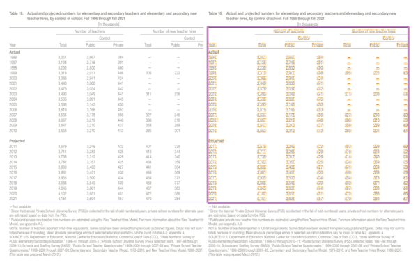
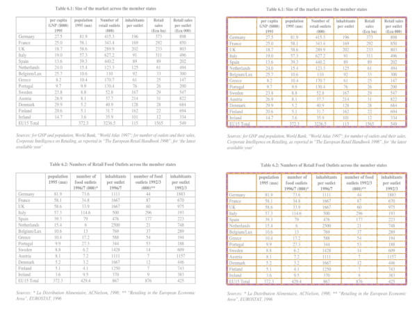

NuGet packages available on the [releases](https://github.com/BobLd/tabula-sharp/releases) page and on www.nuget.org:
- [Tabula](https://www.nuget.org/packages/Tabula)
- [Tabula.Json](https://www.nuget.org/packages/Tabula.Json)
- [Tabula.Csv](https://www.nuget.org/packages/Tabula.Csv)

# tabula-sharp
Port of [tabula-java](https://github.com/tabulapdf/tabula-java)


- Supports .NET Core 3.1; .NET Standard 2.0; .NET Framework 4.5, 4.51, 4.52, 4.6, 4.61, 4.62, 4.7
- No java bindings

# HELP WANTED
- The original java implementation uses STR trees in [`RectangleSpatialIndex`](https://github.com/tabulapdf/tabula-java/blob/master/src/main/java/technology/tabula/RectangleSpatialIndex.java). This is not the case here so it might be a bit slower. Any help implementing a similar approach is welcome.


## Differences with tabula-java
- Uses [PdfPig](https://github.com/UglyToad/PdfPig), and not PdfBox.
- Coordinate system starts from the bottom left point (going up) of the page, and not from the top left point (going down).
- The `NurminenDetectionAlgorithm` is replaced by `SimpleNurminenDetectionAlgorithm`, because it requieres an image management library.
- Table results might be different because of the way PdfPig builds Letters bounding box.

# Usage
## Stream mode - BasicExtractionAlgorithm
```csharp
using (PdfDocument document = PdfDocument.Open("doc.pdf", new ParsingOptions() { ClipPaths = true }))
{
	ObjectExtractor oe = new ObjectExtractor(document);
	PageArea page = oe.Extract(1);
	
	// detect canditate table zones
	SimpleNurminenDetectionAlgorithm detector = new SimpleNurminenDetectionAlgorithm();
	var regions = detector.Detect(page);
	
	IExtractionAlgorithm ea = new BasicExtractionAlgorithm();
	List<Table> tables = ea.Extract(page.GetArea(regions[0].BoundingBox)); // take first candidate area
	var table = tables[0];
	var rows = table.Rows;
}
```
## Lattice mode - SpreadsheetExtractionAlgorithm
```csharp
using (PdfDocument document = PdfDocument.Open("doc.pdf", new ParsingOptions() { ClipPaths = true }))
{
	ObjectExtractor oe = new ObjectExtractor(document);
	PageArea page = oe.Extract(1);

	IExtractionAlgorithm ea = new SpreadsheetExtractionAlgorithm();
	List<Table> tables = ea.Extract(page);
	var table = tables[0];
	var rows = table.Rows;
}
```

# Results
## Stream mode - BasicExtractionAlgorithm

## Lattice mode - SpreadsheetExtractionAlgorithm

